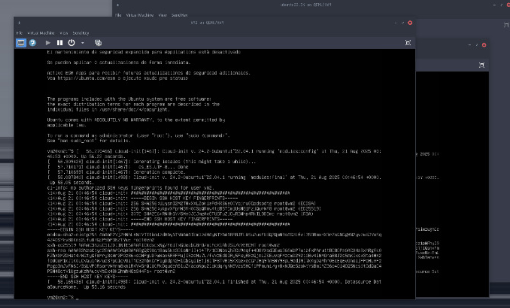

# Manual Técnico - Proyecto 1 Sistemas Operativos 1

**Carnet:** 202200214  
**Estudiante:** Pablo Alejandro Marroquin Cutz  
**Curso:** Sistemas Operativos 1  
**Período:** 2S2025  

---

## Tabla de Contenidos

1. [Resumen Ejecutivo](#resumen-ejecutivo)
2. [Arquitectura del Sistema](#arquitectura-del-sistema)
3. [Requisitos Técnicos](#requisitos-técnicos)
4. [Instalación y Configuración](#instalación-y-configuración)
5. [Desarrollo de APIs](#desarrollo-de-apis)
6. [Contenerización](#contenerización)
7. [Configuración de Registry ZOT](#configuración-de-registry-zot)
8. [Comunicación Entre Servicios](#comunicación-entre-servicios)
9. [Pruebas y Validación](#pruebas-y-validación)
10. [Troubleshooting](#troubleshooting)
11. [Conclusiones](#conclusiones)

---

## Resumen Ejecutivo

Este proyecto implementa un entorno virtualizado que integra máquinas virtuales (VMs) y contenedores, utilizando tecnologías modernas como Docker, Containerd, Go con Fiber y Zot. El sistema simula un entorno de desarrollo real con comunicación entre servicios distribuidos.

### Componentes Principales
- **3 Máquinas Virtuales** creadas con KVM
- **3 APIs REST** desarrolladas en Go utilizando el framework Fiber
- **Registry privado** con Zot para gestión de imágenes
- **Comunicación cruzada** entre todos los servicios

---

## Arquitectura del Sistema

### Diagrama de Arquitectura

```
┌─────────────────┐    ┌─────────────────┐    ┌─────────────────┐
│       VM1       │    │       VM2       │    │       VM3       │
│   Ubuntu 24.04  │    │   Ubuntu 24.04  │    │   Ubuntu 24.04  │
├─────────────────┤    ├─────────────────┤    ├─────────────────┤
│   Containerd    │    │   Containerd    │    │     Docker      │
├─────────────────┤    ├─────────────────┤    ├─────────────────┤
│ Container: API1 │    │ Container: API3 │    │ Container: ZOT  │
│   (Puerto 8080) │    │   (Puerto 8082) │    │   (Puerto 5000) │
│                 │    │                 │    │                 │
│ Container: API2 │    │                 │    │                 │
│   (Puerto 8081) │    │                 │    │                 │
└─────────────────┘    └─────────────────┘    └─────────────────┘
         │                       │                       │
         └───────────────────────┼───────────────────────┘
                                 │
                    ┌─────────────────┐
                    │  Red Virtual    │
                    │  192.168.122.0  │
                    └─────────────────┘
```

### Distribución de Servicios

| VM | Sistema | Runtime | Contenedores | IPs |
|----|---------|---------|--------------|----|
| VM1 | Ubuntu 24.04.5 | Containerd | API1 (8080), API2 (8081) | 192.168.122.2 |
| VM2 | Ubuntu 24.04.5 | Containerd | API3 (8082) | 192.168.122.3 |
| VM3 | Ubuntu 24.04.5 | Docker | ZOT Registry (5000) | 192.168.122.4 |

### Comunicación Entre APIs

| API | Endpoint 1 | Endpoint 2 |
|-----|------------|------------|
| API1 | `GET /api1/202200214/llamar-api2` | `GET /api1/202200214/llamar-api3` |
| API2 | `GET /api2/202200214/llamar-api1` | `GET /api2/202200214/llamar-api3` |
| API3 | `GET /api3/202200214/llamar-api1` | `GET /api3/202200214/llamar-api2` |

---

## Requisitos Técnicos

### Sistema Host
- **OS:** Ubuntu 24.04 LTS o Archcraft
- **RAM:** Mínimo 8GB (recomendado 16GB)
- **Disco:** 100GB libres
- **CPU:** Soporte para virtualización (Intel VT-x / AMD-V)

### Software Requerido
- KVM/QEMU
- libvirt
- virt-manager
- Go 1.21+
- Git

---

## Instalación y Configuración

### Paso 1: Preparar el Sistema Host

#### Instalar KVM y herramientas de virtualización
```bash
# Instalar paquetes necesarios
sudo pacman -S qemu-full virt-manager virt-viewer dnsmasq vde2 bridge-utils openbsd-netcat libvirt ebtables

# Habilitar servicios
sudo systemctl enable libvirtd.service
sudo systemctl start libvirtd.service

# Agregar usuario al grupo libvirt
sudo usermod -aG libvirt $USER
newgrp libvirt
```

#### Verificar instalación
```bash
# Verificar KVM
lsmod | grep kvm

# Verificar libvirt
virsh list --all
```

### Paso 2: Descargar ISO de Ubuntu Server

```bash
# Crear directorio para ISOs
mkdir -p ~/isos
cd ~/isos

# Instalar wget si no está disponible
sudo pacman -S wget

# Descargar Ubuntu Server 24.04 LTS
wget https://releases.ubuntu.com/24.04/ubuntu-24.04.1-live-server-amd64.iso
```

### Paso 3: Crear Máquinas Virtuales

#### Crear VM1 (para API1 y API2)
1. Abrir virt-manager: `virt-manager`
2. **File → New Virtual Machine**
3. **Local install media → Forward**
4. **Browse** → Seleccionar la ISO de Ubuntu
5. **OS:** Ubuntu 24.04 LTS
6. **Memory:** 2048 MB, **CPUs:** 2
7. **Storage:** 20 GB
8. **Name:** VM1-APIs
9. **Finish**

#### Crear VM2 (para API3)
- **Memory:** 2048 MB, **CPUs:** 1
- **Storage:** 25 GB  
- **Name:** VM2-API3

#### Crear VM3 (para ZOT)
- **Memory:** 2048 MB, **CPUs:** 1
- **Storage:** 25 GB
- **Name:** VM3-ZOT

### Paso 4: Instalar Ubuntu en cada VM

Para cada VM:
1. **Boot** desde la ISO
2. Seguir el asistente de instalación
3. **Usuario:** vm1user, vm2user, vm3user respectivamente
4. **Hostname:** vm1, vm2, vm3
5. Instalar **OpenSSH server**

### Paso 5: Configuración Post-instalación

#### En todas las VMs:
```bash
# Actualizar sistema
sudo apt update && sudo apt upgrade -y

# Instalar herramientas básicas
sudo apt install -y curl wget git nano htop net-tools build-essential
```

#### Instalar Go (en VM1 y VM2)
```bash
# Descargar Go 1.21
wget https://go.dev/dl/go1.21.0.linux-amd64.tar.gz
sudo tar -C /usr/local -xzf go1.21.0.linux-amd64.tar.gz

# Configurar PATH
echo 'export PATH=$PATH:/usr/local/go/bin' >> ~/.bashrc
echo 'export GOPATH=$HOME/go' >> ~/.bashrc
source ~/.bashrc

# Verificar
go version
```

#### Configurar Containerd (VM1 y VM2)
```bash
# Instalar containerd
sudo apt install -y containerd runc

# Generar configuración por defecto
sudo mkdir -p /etc/containerd
containerd config default | sudo tee /etc/containerd/config.toml

# Reiniciar servicio
sudo systemctl restart containerd
sudo systemctl enable containerd

# Verificar
sudo ctr version
```

#### Configurar Docker (VM3)
```bash
# Agregar repositorio de Docker
curl -fsSL https://download.docker.com/linux/ubuntu/gpg | sudo gpg --dearmor -o /usr/share/keyrings/docker-archive-keyring.gpg

echo "deb [arch=$(dpkg --print-architecture) signed-by=/usr/share/keyrings/docker-archive-keyring.gpg] https://download.docker.com/linux/ubuntu $(lsb_release -cs) stable" | sudo tee /etc/apt/sources.list.d/docker.list > /dev/null

# Instalar Docker
sudo apt update
sudo apt install -y docker-ce docker-ce-cli containerd.io docker-buildx-plugin docker-compose-plugin

# Configurar usuario
sudo usermod -aG docker $USER
newgrp docker

# Verificar
docker --version
```

---

## Desarrollo de APIs

### Estructura de Proyecto
```
~/proyecto_so1/
├── api1/
│   ├── main.go
│   ├── go.mod
│   ├── go.sum
│   └── Dockerfile
├── api2/
│   ├── main.go
│   ├── go.mod
│   ├── go.sum
│   └── Dockerfile
├── api3/
│   ├── main.go
│   ├── go.mod
│   ├── go.sum
│   └── Dockerfile
└── scripts/
    ├── build.sh
    └── deploy.sh
```

### API1 (Puerto 8080)

#### Archivo: `~/proyecto_so1/api1/main.go`
```go
package main

import (
    "fmt"
    "net/http"
    "github.com/gofiber/fiber/v2"
)

func main() {
    nombre := "Pablo Alejandro Marroquin Cutz"
    carnet := "202200214"
    endPointGeneric := "/api1/202200214/"

    app := fiber.New()

    app.Get("/", func(c *fiber.Ctx) error {
        return c.JSON(fiber.Map{
            "mensaje": fmt.Sprintf("API1 en la VM1 - Estudiante: %s, Carnet: %s", nombre, carnet),
        })
    })

    app.Get(fmt.Sprintf("%sllamar-api2", endPointGeneric), func(c *fiber.Ctx) error {
        resp, err := http.Get("http://localhost:8081/")
        if err != nil {
            return c.Status(fiber.StatusInternalServerError).JSON(fiber.Map{
                "error": fmt.Sprintf("Error conectando con API2: %v", err),
                "mensaje": fmt.Sprintf("Error conectando con API2. Responde la API: API1 en la VM1, desarrollada por el estudiante %s con carnet: %s", nombre, carnet),
            })
        }
        defer resp.Body.Close()

        buffer := make([]byte, 1024)
        n, _ := resp.Body.Read(buffer)
        apiResponse := string(buffer[:n])

        return c.JSON(fiber.Map{
            "mensaje": fmt.Sprintf("Hola, responde la API: API1 en la VM1, desarrollada por el estudiante %s con carnet: %s. Conexión exitosa con API2", nombre, carnet),
            "respuesta_api2": apiResponse,
        })
    })

    app.Get(fmt.Sprintf("%sllamar-api3", endPointGeneric), func(c *fiber.Ctx) error {
        // IP de VM2 donde está API3
        resp, err := http.Get("http://192.168.122.3:8082/")
        if err != nil {
            return c.Status(fiber.StatusInternalServerError).JSON(fiber.Map{
                "error": fmt.Sprintf("Error conectando con API3: %v", err),
                "mensaje": fmt.Sprintf("Error conectando con API3. Responde la API: API1 en la VM1, desarrollada por el estudiante %s con carnet: %s", nombre, carnet),
            })
        }
        defer resp.Body.Close()

        buffer := make([]byte, 1024)
        n, _ := resp.Body.Read(buffer)
        apiResponse := string(buffer[:n])

        return c.JSON(fiber.Map{
            "mensaje": fmt.Sprintf("Hola, responde la API: API1 en la VM1, desarrollada por el estudiante %s con carnet: %s. Conexión exitosa con API3", nombre, carnet),
            "respuesta_api3": apiResponse,
        })
    })

    fmt.Println("API1 iniciada en puerto 8080")
    app.Listen("0.0.0.0:8080")
}
```

#### Inicializar módulo Go
```bash
cd ~/proyecto_so1/api1
go mod init api1
go mod tidy
```

### API2 (Puerto 8081)

#### Archivo: `~/proyecto_so1/api2/main.go`
```go
package main

import (
    "fmt"
    "net/http"
    "github.com/gofiber/fiber/v2"
)

func main() {
    nombre := "Pablo Alejandro Marroquin Cutz"
    carnet := "202200214"
    endPointGeneric := "/api2/202200214/"

    app := fiber.New()

    app.Get("/", func(c *fiber.Ctx) error {
        return c.JSON(fiber.Map{
            "mensaje": fmt.Sprintf("API2 en la VM1 - Estudiante: %s, Carnet: %s", nombre, carnet),
        })
    })

    app.Get(fmt.Sprintf("%sllamar-api1", endPointGeneric), func(c *fiber.Ctx) error {
        resp, err := http.Get("http://localhost:8080/")
        if err != nil {
            return c.Status(fiber.StatusInternalServerError).JSON(fiber.Map{
                "error": fmt.Sprintf("Error conectando con API1: %v", err),
                "mensaje": fmt.Sprintf("Error conectando con API1. Responde la API: API2 en la VM1, desarrollada por el estudiante %s con carnet: %s", nombre, carnet),
            })
        }
        defer resp.Body.Close()

        buffer := make([]byte, 1024)
        n, _ := resp.Body.Read(buffer)
        apiResponse := string(buffer[:n])

        return c.JSON(fiber.Map{
            "mensaje": fmt.Sprintf("Hola, responde la API: API2 en la VM1, desarrollada por el estudiante %s con carnet: %s. Conexión exitosa con API1", nombre, carnet),
            "respuesta_api1": apiResponse,
        })
    })

    app.Get(fmt.Sprintf("%sllamar-api3", endPointGeneric), func(c *fiber.Ctx) error {
        // IP de VM2 donde está API3
        resp, err := http.Get("http://192.168.122.3:8082/")
        if err != nil {
            return c.Status(fiber.StatusInternalServerError).JSON(fiber.Map{
                "error": fmt.Sprintf("Error conectando con API3: %v", err),
                "mensaje": fmt.Sprintf("Error conectando con API3. Responde la API: API2 en la VM1, desarrollada por el estudiante %s con carnet: %s", nombre, carnet),
            })
        }
        defer resp.Body.Close()

        buffer := make([]byte, 1024)
        n, _ := resp.Body.Read(buffer)
        apiResponse := string(buffer[:n])

        return c.JSON(fiber.Map{
            "mensaje": fmt.Sprintf("Hola, responde la API: API2 en la VM1, desarrollada por el estudiante %s con carnet: %s. Conexión exitosa con API3", nombre, carnet),
            "respuesta_api3": apiResponse,
        })
    })

    fmt.Println("API2 iniciada en puerto 8081")
    app.Listen("0.0.0.0:8081")
}
```

#### Inicializar módulo Go
```bash
cd ~/proyecto_so1/api2
go mod init api2
go mod tidy
```

### API3 (Puerto 8082)

#### Archivo: `~/proyecto_so1/api3/main.go`
```go
package main

import (
    "fmt"
    "net/http"
    "github.com/gofiber/fiber/v2"
)

func main() {
    nombre := "Pablo Alejandro Marroquin Cutz"
    carnet := "202200214"
    endPointGeneric := "/api3/202200214/"

    app := fiber.New()

    app.Get("/", func(c *fiber.Ctx) error {
        return c.JSON(fiber.Map{
            "mensaje": fmt.Sprintf("API3 en la VM2 - Estudiante: %s, Carnet: %s", nombre, carnet),
        })
    })

    app.Get(fmt.Sprintf("%sllamar-api1", endPointGeneric), func(c *fiber.Ctx) error {
        // IP de VM1 donde está API1
        resp, err := http.Get("http://192.168.122.2:8080/")
        if err != nil {
            return c.Status(fiber.StatusInternalServerError).JSON(fiber.Map{
                "error": fmt.Sprintf("Error conectando con API1: %v", err),
                "mensaje": fmt.Sprintf("Error conectando con API1. Responde la API: API3 en la VM2, desarrollada por el estudiante %s con carnet: %s", nombre, carnet),
            })
        }
        defer resp.Body.Close()

        buffer := make([]byte, 1024)
        n, _ := resp.Body.Read(buffer)
        apiResponse := string(buffer[:n])

        return c.JSON(fiber.Map{
            "mensaje": fmt.Sprintf("Hola, responde la API: API3 en la VM2, desarrollada por el estudiante %s con carnet: %s. Conexión exitosa con API1", nombre, carnet),
            "respuesta_api1": apiResponse,
        })
    })

    app.Get(fmt.Sprintf("%sllamar-api2", endPointGeneric), func(c *fiber.Ctx) error {
        // IP de VM1 donde está API2
        resp, err := http.Get("http://192.168.122.2:8081/")
        if err != nil {
            return c.Status(fiber.StatusInternalServerError).JSON(fiber.Map{
                "error": fmt.Sprintf("Error conectando con API2: %v", err),
                "mensaje": fmt.Sprintf("Error conectando con API2. Responde la API: API3 en la VM2, desarrollada por el estudiante %s con carnet: %s", nombre, carnet),
            })
        }
        defer resp.Body.Close()

        buffer := make([]byte, 1024)
        n, _ := resp.Body.Read(buffer)
        apiResponse := string(buffer[:n])

        return c.JSON(fiber.Map{
            "mensaje": fmt.Sprintf("Hola, responde la API: API3 en la VM2, desarrollada por el estudiante %s con carnet: %s. Conexión exitosa con API2", nombre, carnet),
            "respuesta_api2": apiResponse,
        })
    })

    fmt.Println("API3 iniciada en puerto 8082")
    app.Listen("0.0.0.0:8082")
}
```

#### Inicializar módulo Go
```bash
cd ~/proyecto_so1/api3
go mod init api3
go mod tidy
```

---

## Contenerización

### Dockerfiles

#### Dockerfile para API1
```dockerfile
# ~/proyecto_so1/api1/Dockerfile
FROM golang:1.21-alpine AS builder

WORKDIR /app
COPY go.mod go.sum ./
RUN go mod download

COPY . .
RUN go build -o api1 main.go

FROM alpine:latest
RUN apk --no-cache add ca-certificates
WORKDIR /root/

COPY --from=builder /app/api1 .

EXPOSE 8080
CMD ["./api1"]
```

#### Dockerfile para API2
```dockerfile
# ~/proyecto_so1/api2/Dockerfile
FROM golang:1.21-alpine AS builder

WORKDIR /app
COPY go.mod go.sum ./
RUN go mod download

COPY . .
RUN go build -o api2 main.go

FROM alpine:latest
RUN apk --no-cache add ca-certificates
WORKDIR /root/

COPY --from=builder /app/api2 .

EXPOSE 8081
CMD ["./api2"]
```

#### Dockerfile para API3
```dockerfile
# ~/proyecto_so1/api3/Dockerfile
FROM golang:1.21-alpine AS builder

WORKDIR /app
COPY go.mod go.sum ./
RUN go mod download

COPY . .
RUN go build -o api3 main.go

FROM alpine:latest
RUN apk --no-cache add ca-certificates
WORKDIR /root/

COPY --from=builder /app/api3 .

EXPOSE 8082
CMD ["./api3"]
```

### Construir Imágenes

#### En VM1 (para API1 y API2)
```bash
# Construir imagen API1
cd ~/proyecto_so1/api1
sudo ctr image build -t api1-vm1:v1.0 .

# Construir imagen API2
cd ~/proyecto_so1/api2
sudo ctr image build -t api2-vm1:v1.0 .

# Listar imágenes
sudo ctr images list
```

#### En VM2 (para API3)
```bash
# Construir imagen API3
cd ~/proyecto_so1/api3
sudo ctr image build -t api3-vm2:v1.0 .

# Listar imágenes
sudo ctr images list
```

---

## Configuración de Registry ZOT

### En VM3: Instalar y Configurar ZOT

#### Instalar ZOT
```bash
# Descargar ZOT
wget https://github.com/project-zot/zot/releases/download/v2.0.1/zot-linux-amd64
chmod +x zot-linux-amd64
sudo mv zot-linux-amd64 /usr/local/bin/zot

# Crear directorio de configuración
sudo mkdir -p /etc/zot
sudo mkdir -p /var/lib/zot
```

#### Configurar ZOT
```bash
# Crear archivo de configuración
sudo tee /etc/zot/config.json << 'EOF'
{
  "distSpecVersion": "1.1.0",
  "storage": {
    "rootDirectory": "/var/lib/zot"
  },
  "http": {
    "address": "0.0.0.0",
    "port": "5000"
  },
  "log": {
    "level": "info"
  }
}
EOF
```

#### Crear servicio systemd para ZOT
```bash
sudo tee /etc/systemd/system/zot.service << 'EOF'
[Unit]
Description=OCI Registry
After=network.target

[Service]
Type=exec
ExecStart=/usr/local/bin/zot serve /etc/zot/config.json
Restart=on-failure
User=root

[Install]
WantedBy=multi-user.target
EOF

# Habilitar y iniciar ZOT
sudo systemctl daemon-reload
sudo systemctl enable zot
sudo systemctl start zot

# Verificar estado
sudo systemctl status zot
```

#### Verificar funcionamiento
```bash
# Probar registry
curl http://localhost:5000/v2/

# Debería devolver: {}
```

---

## Comunicación Entre Servicios

### Configurar red entre VMs

#### Verificar IPs de las VMs
```bash
# En cada VM ejecutar:
ip addr show

# Las IPs típicas son:
# VM1: 192.168.122.2
# VM2: 192.168.122.3  
# VM3: 192.168.122.4
```

### Subir imágenes al Registry ZOT

#### Desde VM1: Subir API1 y API2
```bash
# Etiquetar imágenes para el registry
sudo ctr image tag api1-vm1:v1.0 192.168.122.4:5000/api1-vm1:v1.0
sudo ctr image tag api2-vm1:v1.0 192.168.122.4:5000/api2-vm1:v1.0

# Subir al registry
sudo ctr image push 192.168.122.4:5000/api1-vm1:v1.0 --plain-http
sudo ctr image push 192.168.122.4:5000/api2-vm1:v1.0 --plain-http
```

#### Desde VM2: Subir API3
```bash
# Etiquetar imagen para el registry
sudo ctr image tag api3-vm2:v1.0 192.168.122.4:5000/api3-vm2:v1.0

# Subir al registry
sudo ctr image push 192.168.122.4:5000/api3-vm2:v1.0 --plain-http
```

#### Verificar imágenes en el registry
```bash
# Desde cualquier VM
curl http://192.168.122.4:5000/v2/_catalog

# Debería mostrar:
# {"repositories":["api1-vm1","api2-vm1","api3-vm2"]}
```

### Ejecutar contenedores

#### En VM1: Ejecutar API1 y API2
```bash
# Ejecutar API1
sudo ctr run --rm --net-host 192.168.122.4:5000/api1-vm1:v1.0 api1-container &

# Ejecutar API2  
sudo ctr run --rm --net-host 192.168.122.4:5000/api2-vm1:v1.0 api2-container &

# Verificar contenedores corriendo
sudo ctr containers list
```

#### En VM2: Ejecutar API3
```bash
# Ejecutar API3
sudo ctr run --rm --net-host 192.168.122.4:5000/api3-vm2:v1.0 api3-container &

# Verificar contenedor corriendo
sudo ctr containers list
```

---

## Pruebas y Validación

### Pruebas de Conectividad

#### Desde el host (Archcraft):
```bash
# Probar todas las APIs
curl http://192.168.122.2:8080/
curl http://192.168.122.2:8081/
curl http://192.168.122.3:8082/
```

#### Probar endpoints específicos:
```bash
# Desde API1 llamar a API2
curl http://192.168.122.2:8080/api1/202200214/llamar-api2

# Desde API1 llamar a API3
curl http://192.168.122.2:8080/api1/202200214/llamar-api3

# Desde API2 llamar a API1
curl http://192.168.122.2:8081/api2/202200214/llamar-api1

# Desde API2 llamar a API3
curl http://192.168.122.2:8081/api2/202200214/llamar-api3

# Desde API3 llamar a API1
curl http://192.168.122.3:8082/api3/202200214/llamar-api1

# Desde API3 llamar a API2
curl http://192.168.122.3:8082/api3/202200214/llamar-api2
```

### Respuestas Esperadas

Cada endpoint debe devolver un JSON con el formato:
```json
{
  "mensaje": "Hola, responde la API: [NOMBRE_DE_LA_API] en la [NOMBRE_DE_VM], desarrollada por el estudiante Pablo Alejandro Marroquin Cutz con carnet: 202200214"
}
```

---

## Troubleshooting

### Problemas Comunes

#### Contenedores no se ejecutan
```bash
# Verificar imágenes
sudo ctr images list

# Verificar contenedores
sudo ctr containers list

# Ver logs
sudo ctr tasks exec --exec-id bash api1-container /bin/sh
```

#### Problemas de conectividad entre VMs
```bash
# Verificar IPs
ip addr show

# Probar conectividad
ping 192.168.122.2
ping 192.168.122.3
ping 192.168.122.4

# Verificar puertos abiertos
netstat -tulpn | grep :8080
```

#### Registry ZOT no funciona
```bash
# Verificar servicio
sudo systemctl status zot

# Ver logs
sudo journalctl -u zot -f

# Reiniciar servicio
sudo systemctl restart zot
```

#### Go no se encuentra
```bash
# Verificar instalación
go version

# Reinstalar Go si es necesario
export PATH=$PATH:/usr/local/go/bin
echo 'export PATH=$PATH:/usr/local/go/bin' >> ~/.bashrc
```

#### Problemas con dependencias de Fiber
```bash
# Limpiar caché de módulos
go clean -modcache

# Reinstalar dependencias
go mod download
go mod tidy

# Verificar versiones
go list -m all
```

---

## Scripts de Automatización

### Script de construcción
```bash
#!/bin/bash
# ~/proyecto_so1/scripts/build.sh

echo "Construyendo imágenes..."

# API1
cd ~/proyecto_so1/api1
go mod tidy
sudo ctr image build -t api1-vm1:v1.0 .

# API2  
cd ~/proyecto_so1/api2
go mod tidy
sudo ctr image build -t api2-vm1:v1.0 .

# API3
cd ~/proyecto_so1/api3
go mod tidy
sudo ctr image build -t api3-vm2:v1.0 .

echo "Imágenes construidas exitosamente"
```

### Script de despliegue
```bash
#!/bin/bash
# ~/proyecto_so1/scripts/deploy.sh

echo "Desplegando contenedores..."

# VM1
sudo ctr run --rm --net-host api1-vm1:v1.0 api1-container &
sudo ctr run --rm --net-host api2-vm1:v1.0 api2-container &

echo "Contenedores desplegados"
echo "API1: http://localhost:8080"
echo "API2: http://localhost:8081"
```

---

## Anexos

### Anexo A: Especificaciones Técnicas Detalladas

#### Recursos Asignados
| VM | OS | RAM | CPU | Disco | Runtime | Servicios |
|----|----|----|-----|-------|---------|-----------|
| VM1 | Ubuntu 24.04 | 2GB | 2 cores | 20GB | containerd | API1:8080, API2:8081 |
| VM2 | Ubuntu 24.04 | 2GB | 1 core | 20GB | containerd | API3:8082 |
| VM3 | Ubuntu 24.04 | 2GB | 1 core | 20GB | docker | ZOT:5000 |

#### Red Virtual
- **Subnet**: 192.168.122.0/24
- **Gateway**: 192.168.122.1
- **DNS**: 192.168.122.1
- **DHCP Range**: 192.168.122.2-254

#### Versiones de Software
- **Go**: 1.21.0
- **Fiber**: v2.x (latest)
- **containerd**: 1.7.x
- **Docker**: 24.0.x
- **ZOT**: 2.0.1
- **Ubuntu**: 24.04.1 LTS

### Anexo B: Comandos de Limpieza y Mantenimiento

#### Detener todos los servicios
```bash
# VM1 y VM2 - Detener contenedores containerd
sudo ctr tasks kill api1-container
sudo ctr tasks kill api2-container
sudo ctr tasks kill api3-container

# VM3 - Detener ZOT
sudo systemctl stop zot
```

#### Limpiar contenedores e imágenes
```bash
# Eliminar contenedores
sudo ctr containers delete api1-container api2-container

# Eliminar imágenes locales
sudo ctr images delete api1-vm1:v1.0 api2-vm1:v1.0 api3-vm2:v1.0

# Limpiar registry ZOT
sudo rm -rf /var/lib/zot/*
sudo systemctl restart zot
```

#### Script de limpieza completa
```bash
#!/bin/bash
# ~/proyecto_so1/scripts/cleanup.sh

echo "Limpiando entorno..."

# Detener contenedores
sudo ctr tasks kill api1-container 2>/dev/null || true
sudo ctr tasks kill api2-container 2>/dev/null || true
sudo ctr tasks kill api3-container 2>/dev/null || true

# Eliminar contenedores
sudo ctr containers delete api1-container 2>/dev/null || true
sudo ctr containers delete api2-container 2>/dev/null || true  
sudo ctr containers delete api3-container 2>/dev/null || true

# Eliminar imágenes
sudo ctr images delete api1-vm1:v1.0 2>/dev/null || true
sudo ctr images delete api2-vm1:v1.0 2>/dev/null || true
sudo ctr images delete api3-vm2:v1.0 2>/dev/null || true

# Limpiar caché de Go
go clean -modcache 2>/dev/null || true

echo "Limpieza completada"
```

### Anexo C: Referencias y Documentación

#### Enlaces Útiles
- [Fiber Framework Documentation](https://docs.gofiber.io/)
- [Go Modules Documentation](https://golang.org/doc/modules/)
- [Documentación oficial de containerd](https://containerd.io/docs/)
- [Docker Documentation](https://docs.docker.com/)
- [ZOT Registry Documentation](https://zotregistry.io/docs/)
- [Go Documentation](https://golang.org/doc/)
- [KVM/QEMU Documentation](https://www.qemu.org/documentation/)

#### Comandos de Referencia Rápida con Fiber
```bash
# Comandos Go con Fiber
go mod init <nombre-api>
go get github.com/gofiber/fiber/v2
go mod tidy
go run main.go

# Containerd
sudo ctr images list
sudo ctr containers list
sudo ctr run --rm --net-host <image> <container-name>

# Docker  
docker images
docker ps
docker run -d --name <name> -p <port>:<port> <image>

# ZOT Registry
curl http://<registry-ip>:5000/v2/_catalog
curl http://<registry-ip>:5000/v2/<repo>/tags/list

# Networking
ip addr show
ping <target-ip>
netstat -tulpn | grep <port>

# Pruebas de APIs con JSON formatting
curl -s http://192.168.122.2:8080/ | jq
curl -s http://192.168.122.2:8080/api1/202200214/llamar-api2 | jq '.'
```

#### Estructura de respuesta JSON esperada
```json
{
  "mensaje": "Hola, responde la API: API1 en la VM1, desarrollada por el estudiante Pablo Alejandro Marroquin Cutz con carnet: 202200214. Conexión exitosa con API2",
  "respuesta_api2": "API2 en la VM1 - Estudiante: Pablo Alejandro Marroquin Cutz, Carnet: 202200214"
}
```

---
### Maquinas Virtuales funcionando

### Maquinas Virtuales en KVM

---