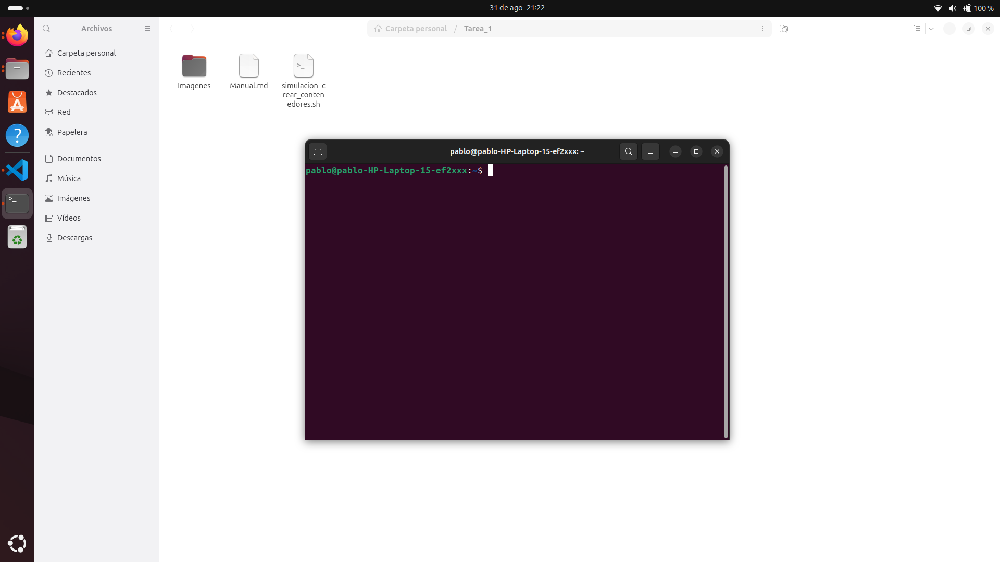

# Manual de Tarea 1 - Comandos Linux y Script Bash

**Carnet:** 202200214  
**Nombre:** Pablo Alejandro Marroquin Cutz  
**Curso:** Sistemas Operativos 1  
**Fecha:** Septiembre 2025

---

## 📋 Introducción

En esta tarea se trabajará con los comandos básicos del sistema operativo Linux, enfocados en la navegación de directorios, manipulación de archivos, visualización de contenido y gestión de permisos. Además, se implementará un pequeño script Bash que permitirá automatizar la creación de archivos con nombres aleatorios, simulando contenedores simples.

Esta actividad es fundamental para introducir al estudiante en el entorno de línea de comandos, base del manejo de servidores, entornos virtualizados y contenedores, elementos clave en el desarrollo de sistemas y la administración de infraestructura moderna.

---

## 🎯 Competencias

- Utiliza comandos básicos de sistemas operativos tipo Unix para realizar tareas de administración y automatización de procesos.
- Aplica conocimientos sobre scripting para resolver problemas mediante soluciones automatizadas.
- Desarrolla habilidades prácticas en la gestión de sistemas operativos Linux.

---

## 🛠️ Desarrollo de la Actividad

### 1. Instalación del Entorno Linux

Para esta práctica se utilizó un sistema Ubuntu ejecutándose en un HP Laptop 15-ef2xxx, como se puede observar en el prompt del terminal:



```bash
pablo@pablo-HP-Laptop-15-ef2xxx:~/Tarea_1$
```

### 2. Comandos Básicos Documentados

#### 2.1 Navegación de Directorios

**Estado inicial del directorio sin ejecutar el script:**


**Comando `ls`** - Listar contenidos del directorio:
```bash
pablo@pablo-HP-Laptop-15-ef2xxx:~/Tarea_1$ ls
contenedor_202200214_6ryykjkr.txt  Imagenes
contenedor_202200214_g64bf3fp.txt  Manual.md
contenedor_202200214_mamssgxl.txt  simulacion_crear_contenedores.sh
contenedor_202200214_zdznd4m0.txt
```

**Comando `cd`** - Cambiar de directorio:


```bash
pablo@pablo-HP-Laptop-15-ef2xxx:~/Tarea_1$ cd Imagenes/
pablo@pablo-HP-Laptop-15-ef2xxx:~/Tarea_1/Imagenes$
```

**Listado del directorio de imágenes:**
```bash
pablo@pablo-HP-Laptop-15-ef2xxx:~/Tarea_1/Imagenes$ ls
'Codigo a ejecutar.png'  'Contenedor 3.png'  'Sin ejecutar.png'
'Contenedor 1.png'       'Contenedor 4.png'   Terminal.png
'Contenedor 2.png'       'El CD.png'         'Ya corrido.png'
```

### 3. Script de Simulación de Contenedores

#### 3.1 Código del Script

**Visualización del código antes de ejecutar:**


El archivo `simulacion_crear_contenedores.sh` contiene el siguiente código:

```bash
#!/bin/bash
echo " Iniciando la simulación de creación de contenedores!"
echo " Ubicación actual del script:"
pwd
echo ""
echo " Generando número aleatorio de contenedores (entre 1 y 4)..."
num_contenedores=$((RANDOM % 4 + 1))
echo " Vamos a crear $num_contenedores contenedores"
echo ""
echo " Iniciando proceso de creación..."
for i in $(seq 1 $num_contenedores)
do
    echo " Creando contenedor #$i..."
    nombre_aleatorio=""
    for j in {1..8}
    do
        caracteres="abcdefghijklmnopqrstuvwxyz0123456789"
        indice=$((RANDOM % ${#caracteres}))
        caracter=${caracteres:$indice:1}
        nombre_aleatorio="$nombre_aleatorio$caracter"
    done
    nombre_archivo="contenedor_202200214_$nombre_aleatorio.txt"
    echo " Creando archivo: $nombre_archivo"
    touch "$nombre_archivo"
    echo "$nombre_archivo" > "$nombre_archivo"
    echo " Contenedor $nombre_archivo creado exitosamente"
done
echo ""
echo "¡Proceso completado!"
echo "Resumen de contenedores creados:"
echo "Archivos creados en esta ejecución:"
ls -la contenedor_202200214_*.txt 2>/dev/null || echo " ⚠️ No se encontraron archivos"
echo ""
echo "Contenido de los archivos creados:"
for archivo in contenedor_202200214_*.txt
do
    if [ -f "$archivo" ]; then
        echo " Contenido de $archivo:"
        echo " $(cat "$archivo")"
    fi
done
echo ""
echo " ¡Simulación de contenedores completada con éxito!"
echo " Los contenedores fueron creados en: $(pwd)"
```

#### 3.2 Funcionalidades del Script

El script `simulacion_crear_contenedores.sh` implementa las siguientes funcionalidades:

**🎲 Generación Aleatoria:**
- Genera un número aleatorio entre 1 y 4 para determinar cuántos contenedores crear
- Utiliza `$((RANDOM % 4 + 1))` para obtener el número aleatorio

**📝 Creación de Nombres Aleatorios:**
- Genera cadenas de 8 caracteres usando letras minúsculas y números
- Utiliza un conjunto de caracteres: `abcdefghijklmnopqrstuvwxyz0123456789`
- Aplica el patrón: `contenedor_202200214_NOMBREALEATORIO.txt`

**📄 Creación de Archivos:**
- Utiliza `touch` para crear cada archivo
- Escribe el nombre del archivo como contenido usando redirección `>`

**📊 Verificación y Reporte:**
- Muestra la ubicación actual con `pwd`
- Lista los archivos creados con `ls -la`
- Verifica el contenido de cada archivo con `cat`
- Proporciona retroalimentación detallada durante todo el proceso

#### 3.3 Ejecución del Script

**Resultado después de ejecutar el script:**


Para ejecutar el script se utilizó:
```bash
bash simulacion_crear_contenedores.sh
```

#### 3.4 Archivos Generados y Verificación

Los siguientes archivos fueron creados exitosamente por el script:

1. **contenedor_202200214_6ryykjkr.txt**


2. **contenedor_202200214_g64bf3fp.txt**


3. **contenedor_202200214_mamssgxl.txt**


4. **contenedor_202200214_zdznd4m0.txt**


#### 3.5 Contenido de los Archivos

Cada archivo contiene como contenido su propio nombre, cumpliendo con los requisitos especificados. El script utiliza la línea:
```bash
echo "$nombre_archivo" > "$nombre_archivo"
```

---

## ✅ Resultados Obtenidos

### Estructura Final del Directorio

```
Tarea_1/
├── contenedor_202200214_6ryykjkr.txt
├── contenedor_202200214_g64bf3fp.txt
├── contenedor_202200214_mamssgxl.txt
├── contenedor_202200214_zdznd4m0.txt
├── Imagenes/
│   ├── Codigo a ejecutar.png
│   ├── Contenedor 1.png
│   ├── Contenedor 2.png
│   ├── Contenedor 3.png
│   ├── Contenedor 4.png
│   ├── El CD.png
│   ├── Sin ejecutar.png
│   ├── Terminal.png
│   └── Ya corrido.png
├── Manual.md
└── simulacion_crear_contenedores.sh
```

### Comandos Linux Utilizados

| Comando | Función | Evidencia |
|---------|---------|-----------|
| `ls` | Listar contenido de directorios | Múltiples capturas |
| `cd` | Cambiar de directorio | El CD.png |
| `pwd` | Mostrar directorio actual | Terminal.png |
| `touch` | Crear archivos vacíos | Implementado en script |
| `cat` | Mostrar contenido de archivos | Contenedor 1-4.png |
| `echo` | Mostrar texto y escribir archivos | Todo el script |


